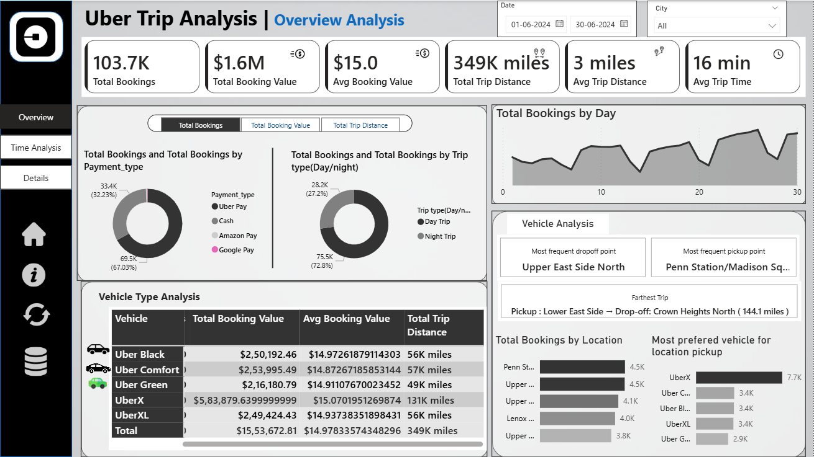

# 🚖 Uber Trip Analysis – Power BI Dashboard  

  

---

## 👨‍💻 Author  
**Valadasu Gnaneswar**  
📧 [Email](mailto:gnaneswargnana@gmail.com) | 💼 [LinkedIn](https://www.linkedin.com/in/valadasu-gnaneswar-821797242/) | 🐙 [GitHub](https://github.com/ValadasuGnaneswar)  

---

## 📌 Project Overview  
This project is an **end-to-end Power BI dashboard** analyzing Uber trip data to uncover **demand patterns, revenue insights, and customer preferences**.  
The dashboard is designed to support **data-driven decision-making** for ride-hailing businesses.  

---

## 🎯 Business Objectives  
✔️ Identify **peak demand periods** by hour, day, and city  
✔️ Track **total bookings, revenue, distance, and trip time**  
✔️ Analyze **pickup & drop-off hotspots**  
✔️ Understand **customer preferences by vehicle type and payment mode**  
✔️ Enable **interactive drill-down analysis** for deeper insights  

---

## 📂 Dashboard Structure  

### 1️⃣ **Overview Analysis**  
- KPIs: Total Bookings, Total Revenue, Avg Distance, Avg Trip Time  
- Charts: Booking by Trip Type, Payment Mode  
- Vehicle Type KPIs & Location Trends  

### 2️⃣ **Time Analysis**  
- 10-Min Interval Area Chart → Demand flow across the day  
- Day-Wise Line Chart → Weekday vs Weekend rides  
- Hour x Day Heatmap → Peak demand patterns  
- Global Measure Selector → Switch between bookings, revenue, distance  

### 3️⃣ **Details Tab**  
- Drill-through to **trip-level data**  
- Grid table with all ride details  
- Export raw data (CSV/Excel)  

---

## 🧠 Key Features  
- 🔄 **Dynamic Measure Selector** (Disconnected Table)  
- 🎚️ **Interactive Slicers** with reset button  
- 🎨 **Conditional Formatting** in grids  
- 🔗 **Drill-through** between reports  
- 📝 **Dynamic Titles & Tooltips**  
- 📤 **One-click Export** of raw trip data  
- 📑 **Bookmarks** for view toggling  

---

## 📊 KPIs Tracked  
- Total Bookings  
- Total Booking Value  
- Average Booking Value  
- Total Trip Distance  
- Average Trip Distance  
- Average Trip Time  

---

## 🔧 Tools & Techniques  
- **Microsoft Power BI**  
- **DAX Measures & Calculations**  
- Disconnected Tables for dynamic metrics  
- Drill-through, Bookmarks & Buttons  
- Area, Line, Heatmap & Matrix visuals  

---

## 📦 Data Source  
- **Uber Trip Dataset** (`Excel/CSV`)  
- Periodically refreshed or manually updated  

---

## 🚀 How to Use  
1. Clone this repository or download the `.pbix` file  
2. Open in **Power BI Desktop**  
3. Use slicers, filters, and buttons to explore data  
4. Drill through for trip-level analysis  
5. Export data as needed  

---

## 🏷️ Repository Tags  
`PowerBI` `Data-Analysis` `Business-Intelligence` `Uber` `Dashboard` `Analytics`  

---

## 👨‍💻 About the Author  
Created by **Valadasu Gnaneswar** – Data Analyst skilled in **Power BI, SQL, Excel, and Data Storytelling**.  
📧 [Email](mailto:gnaneswargnana@gmail.com) | 💼 [LinkedIn](https://www.linkedin.com/in/valadasu-gnaneswar-821797242/) | 🐙 [GitHub](https://github.com/ValadasuGnaneswar)  

---
